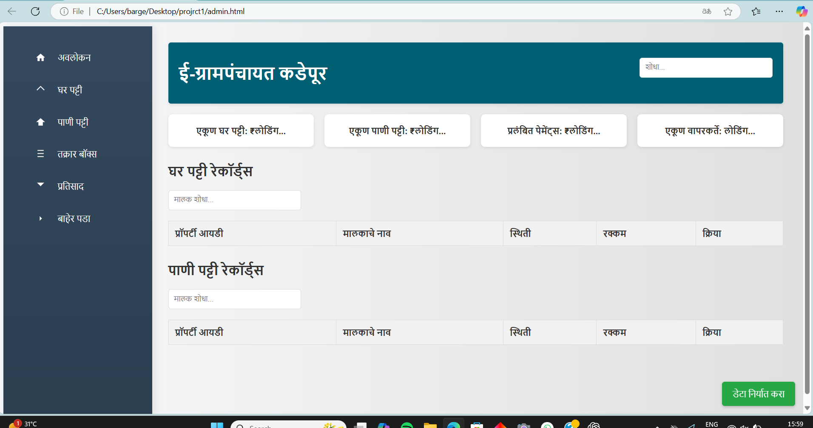

# 💻 Sahil Barge - Java Full Stack Developer Portfolio

Welcome to the official repository for my personal developer portfolio!  
This portfolio showcases my skills, projects, and experience as a **Java Full Stack Developer** using modern web technologies.

🌐 [Live Demo](https://sahil1916.github.io/portfolio/))*

---

## 📄 About

This responsive portfolio website is built with:

- ⚙️ **HTML5, CSS3, JavaScript**
- 🚀 **Font Awesome** for icons
- ✨ Modern UI/UX with animations and transitions
- 🌌 Particle backgrounds and loading effects
- 💡 3D tilt hover interactions
- 📱 Fully responsive on mobile, tablet, and desktop

---

## 📂 Features

- 👨‍💻 **About Me** – Introduction and short bio
- 🛠️ **Skills Section** – Key technologies I work with
- 📁 **Projects** – Real-world Java/Spring Boot based applications
- 🏢 **Experience** – Internship and professional background
- 📬 **Contact Form** – Users can directly contact via email
- 🌙 **Theme Toggle** – Light/Dark mode switcher
- ⚛️ **Particle Effects** – Interactive animated background

---

## 📸 Screenshots

| Home Page | About Section | Project Cards |
|----------|----------------|----------------|
|  |  |  |

---

## 🚀 Projects Highlighted

1. **Tax Collection System**
   - Java + Spring Boot + MySQL
   - Managed 500+ citizen records
   - Secure payment integration and analytics

2. **Online Shopping Cart**
   - Spring MVC + Hibernate
   - User login, product catalog, payment gateway

3. **Tic Tac Toe Game**
   - JavaScript, HTML, CSS
   - AI opponent and multiplayer modes

---

## 📁 Project Structure

```
📁 Portfolio/
│
├── index.html          # Main website file
├── images/             # Project & profile images
├── README.md           # Project documentation
└── ...
```

---

## 📩 Contact Me

- 📧 Email: [bargesahil27@gmail.com](mailto:bargesahil27@gmail.com)
- 🔗 LinkedIn: [linkedin.com/in/sahil-barge](https://linkedin.com/in/sahil-barge)
- 🧑‍💻 GitHub: [github.com/Sahil1916](https://github.com/Sahil1916)

---

## 🧑‍💻 Author

**Sahil Barge**  
Java Full Stack Developer from Pune, Maharashtra.

---


⭐ *If you like this portfolio, feel free to star this repo and share it!*
